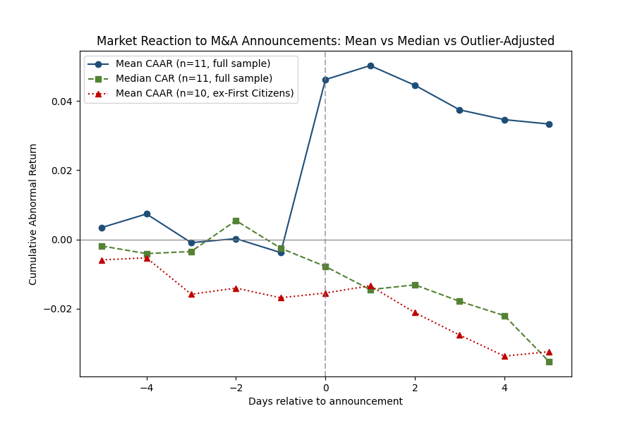
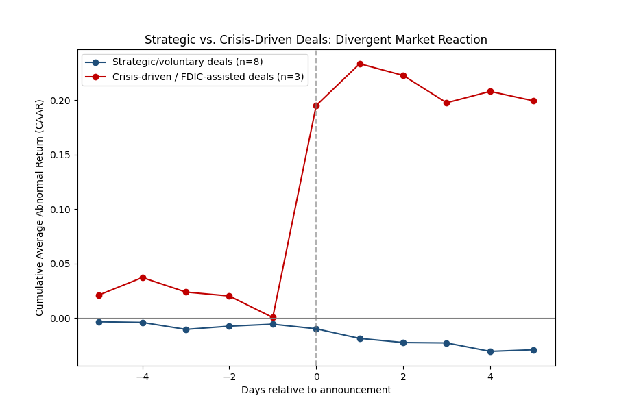
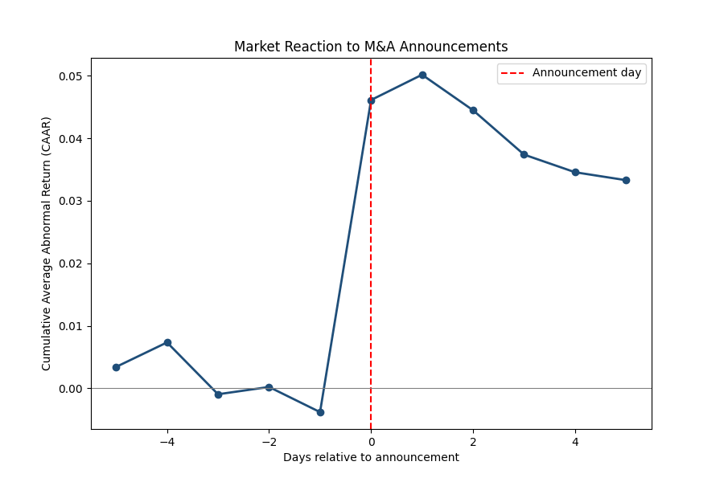

# Market Reaction to M&A Announcements: An Event Study Analysis

An implementation of the event study methodology (MacKinlay, 1997) applied to 11 real bank/financial-services M&A announcements (2020-2024), measuring whether acquirer stock prices show abnormal returns around deal announcements.

## Motivation

Strategy and corporate development teams routinely need to answer one question when evaluating an M&A deal: **did the market think this was a good idea?** This project builds that measurement tool from first principles, pulling real stock price data, fitting a market model, computing abnormal returns, and aggregating across a sample of deals, rather than relying on a black-box calculator.

## Methodology

**Paper:** MacKinlay, A.C. (1997). "Event Studies in Economics and Finance." *Journal of Economic Literature*, 35(1), 13-39.

For each deal:
1. **Estimation window** (trading days -250 to -30 relative to announcement): fit a market model `R_stock = α + β·R_market + ε` via OLS.
2. **Event window** (-5 to +5 trading days): use the fitted α, β to predict the "expected" return, then compute **Abnormal Return (AR)** = actual return − expected return.
3. **Cumulative Abnormal Return (CAR)** = running sum of AR across the event window.
4. Aggregate across all deals to get **CAAR** (Cumulative Average Abnormal Return) and test significance via a cross-sectional t-test.

## Data

11 real M&A announcements, dates verified against SEC filings, company press releases, and regulator statements, listed in [`events.csv`](./events.csv). Mix of Indian and global banking/financial-services deals, plus one non-financial control (Broadcom-VMware).

| Deal | Date | Type |
|---|---|---|
| HDFC-HDFC Bank Merger | 2022-04-04 | Strategic |
| Axis Bank-Citi India Consumer Business | 2022-03-30 | Strategic |
| IDFC Limited-IDFC First Bank Merger | 2023-07-03 | Strategic |
| Capital One-Discover Financial | 2024-02-19 | Strategic |
| Nasdaq-Adenza | 2023-06-12 | Strategic |
| BlackRock-Global Infrastructure Partners | 2024-01-12 | Strategic |
| Morgan Stanley-E*TRADE | 2020-02-20 | Strategic |
| Broadcom-VMware | 2022-05-26 | Strategic (non-financial control) |
| UBS-Credit Suisse | 2023-03-19 | Crisis-driven / government-brokered |
| First Citizens BancShares-Silicon Valley Bank | 2023-03-27 | Crisis-driven / FDIC-assisted |
| JPMorgan Chase-First Republic Bank | 2023-05-01 | Crisis-driven / FDIC-assisted |

## Results

### Headline result



| Day | CAAR | t-stat | p-value |
|---|---|---|---|
| -5 | 0.0034 | 0.33 | 0.74 |
| -4 | 0.0073 | 0.55 | 0.59 |
| -3 | -0.0009 | -0.05 | 0.96 |
| -2 | 0.0002 | 0.01 | 0.99 |
| -1 | -0.0038 | -0.21 | 0.84 |
| **0** | **0.0461** | 0.72 | 0.47 |
| +1 | 0.0502 | 0.77 | 0.44 |
| +2 | 0.0445 | 0.66 | 0.51 |
| +3 | 0.0374 | 0.57 | 0.57 |
| +4 | 0.0346 | 0.50 | 0.62 |
| +5 | 0.0333 | 0.50 | 0.62 |

At face value: a positive jump in CAAR around the announcement day, not statistically significant at conventional thresholds (n=11).

### The result does not survive an outlier check

One deal, **First Citizens BancShares acquiring Silicon Valley Bank**, shows a day-0 AR of **+53.5%**, roughly 6x larger than the next biggest single-day move in the sample. This is a real, well-documented number (the market's reaction to First Citizens acquiring SVB's assets at a steep discount from the FDIC), but it is a fundamentally different kind of event from a normal strategic acquisition, and it single-handedly determines the sign of the full-sample result.



| Day | Mean CAAR (n=11) | Median CAR (n=11) | Mean CAAR ex-First Citizens (n=10) |
|---|---|---|---|
| 0 | +0.0461 | -0.0078 | -0.0155 |
| +3 | +0.0374 | -0.0179 | -0.0276 (p=0.036) |
| +4 | +0.0346 | -0.0220 | -0.0337 (p=0.022) |
| +5 | +0.0333 | -0.0353 | -0.0324 (p=0.015) |

Two things stand out once the outlier is removed:
- **The median CAR is negative or near-zero at every point in the window**, meaning the "typical" deal in this sample never showed the positive reaction the mean suggests.
- **With First Citizens excluded, CAAR turns significantly negative by day +3 through +5** (p < 0.05). This is consistent with the well-documented "acquirer overpayment" / winner's-curse finding in the M&A literature, where acquirers, on average, tend to underperform in the days following a deal announcement.

**The honest headline finding of this project is the reversal itself, not the raw positive spike.** A single outlier flips the sign and significance of the result, and the robust (median, outlier-adjusted) view points toward mild negative acquirer returns, not positive ones.

### Crisis-driven deals behave differently from strategic deals

Splitting the sample into 3 crisis-driven/FDIC-assisted deals (UBS-Credit Suisse, First Citizens-SVB, JPMorgan-First Republic) versus 8 voluntary strategic deals shows a clear divergence:



| Day | Strategic CAAR (n=8) | Crisis CAAR (n=3) |
|---|---|---|
| 0 | -0.0097 | +0.1951 |
| +5 | -0.0290 | +0.1993 |

Crisis-driven acquisitions show a large positive market reaction, since the acquirer is seen as picking up distressed assets cheaply, while voluntary strategic deals trend mildly negative over the event window. Pooling these two deal types together, as the full-sample result does, obscures a real structural difference and is why the full-sample result is not the number to lead with.

## Limitations

- **n=11 is small.** T-tests here should be read as directional, not conclusive. A production version of this analysis would target 30+ deals per subgroup.
- **The market model uses a single index per deal's home market** (Nifty 50, S&P 500, or SMI), with no adjustment for size, sector, or industry-specific benchmarks (e.g. a bank sub-index).
- **Event windows use trading-day offsets**, aligned to the nearest trading day on/after the announcement. Deals announced on weekends (common for crisis-driven rescues) are handled this way rather than via calendar-day offsets, which produced misleading window misalignment in an earlier version of this analysis.
- **Crisis-driven deals are structurally different events** (FDIC-assisted purchases, government-brokered rescues) and arguably shouldn't be pooled with voluntary strategic M&A without the subgroup split shown above.

## Repository structure

```
├── README.md                  # this file
├── events.csv                 # verified event sample with sources
├── event_study.py             # core pipeline: market model, AR, CAR, CAAR
├── robustness_analysis.py     # median CAR, outlier exclusion, crisis/strategic subgroup split
└── assets/
    ├── caar_main_result.png
    ├── caar_robustness.png
    └── caar_subgroups.png
```

## References

MacKinlay, A.C. (1997). "Event Studies in Economics and Finance." *Journal of Economic Literature*, 35(1), 13-39.
